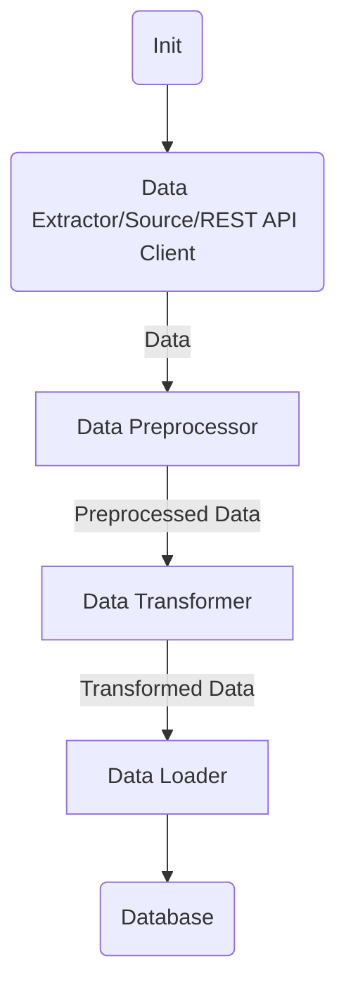

# Apache Beam

<h3>Table of Contents</h3>

[TOC]

# Introduction
- https://beam.apache.org/

## What
- https://beam.apache.org/get-started/beam-overview/
- an advanced unified programming model
	- to define a pipeline
- can define both batch and streaming data-parallel processing pipelines 
	- that pipeline can be run on any execution engine
	- engine: Beam's supported __distributed processing backends__
- useful for [embarrassingly parallel](https://en.wikipedia.org/wiki/Embarassingly_parallel) data processing tasks
	- in which the problem can be decomposed into many smaller bundles of data that can be processed independently and in parallel
	- can also use Beam for Extract, Transform, and Load (ETL) tasks and pure data integration
		- such tasks are useful for moving data between different storage media and data sources, transforming data into a more desirable format, or loading data onto a new system

## Why
- Unified
	- Use a single programming model for both batch and streaming use cases
- Portable
	- Execute pipelines on multiple execution environments
	- Language & Engine Agnostic
		- Java, Python, Go, Scala etc.
		- Direct/Local, Apache Flink, Spark, Samza, Nemo, GCP Dataflow, Twister, Hazelcast Jet etc.
- Extensible
	- Write and share new SDKs, IO connectors, and transformation libraries
- Open Source
	- Community-based development

## How
- Sources
	- Beam reads your data from a diverse set of supported sources, no matter if it’s on-prem or in the cloud
- Processing
	- Beam executes your business logic for Batch and Streaming use cases
- Sinks
	- Beam writes the results of your data processing logic to the most popular data destinations in the industry
	
## Trivia
- was Google's internal project 
- previously knows as dataflow

## Read More
- Quickstart: https://beam.apache.org/get-started/quickstart-py/
- Programming Guide: https://beam.apache.org/documentation/programming-guide/#transforms

# Concept
Pipeline --> DAG, Topology

Input --> Spout, PCollection[PValue], Source

Processor --> Bolt, PTransform[DoFn], Map, Lambda

Output --> Sink, PCollection[PValue], Target

<center>



Figure 1. Flow diagram of a typical data processing pipeline/topology

</center>

## Pipeline

## PTransform

### WebSocket based PTransform
- https://rmannibucau.metawerx.net/apache-beam-websocket-output.html

## ParDo

## DoFn


# Setup

# Prerequisites

# Create

# Run

## Run Locally

## Run on Dataflow Runner

Using service account:

```bash
$ python -m exploratory.wordcount \
    --region us-central1 \
    --input gs://dataflow-samples/shakespeare/kinglear.txt \
    --output gs://apache-beam-eg/results/outputs \
    --runner DataflowRunner \
    --project apache-beam-eg \
    --temp_location gs://apache-beam-eg/tmp/ \
    --service_account_email apache-beam-svc-ac@apache-beam-eg.iam.gserviceaccount.com \
    --subnetwork regions/us-central1/subnetworks/apache-beam-eg-usc1-temp # mention subnetwork other that `default`
```


## Python SKD

References:

- https://beam.apache.org/get-started/quickstart-py/

### Syntax

Inspired from binary arithmetic operators.
Those operators magic methods are overloaded to denote some different pipeline operations.
e.g.

- `|`
	- is a synonym for `apply`, which applies a `PTransform` to a `PCollection` to produce a new `PCollection`
	- `obj.__or__(self, other)`
	- `obj.__ror__(self, other)`

- `>>`
	- allows you to name a step for easier display in various UIs
	- `obj.__rrshift__(self, other)`
- `<SomePCollection> |'SomeLabel' >> <SomePTransform>`
	- `SomeLabel` here is the string between the `|` and the `>>` is only used for these display purposes and identifying that particular application


References:

- https://docs.python.org/3/reference/datamodel.html?highlight=ror#object.__ror__
- https://stackoverflow.com/questions/43796046/explain-apache-beam-python-syntax

- visualization
    - https://stackoverflow.com/questions/54094081/how-to-render-a-pipeline-graph-in-beam

# Observability

- [OpenTelemetry](https://opentelemetry.io/)
- [Jaeger Tracing Dashboard](https://www.jaegertracing.io)
- [Integrate Sentry using OpenTelemetry](https://docs.sentry.io/platforms/python/guides/beam/)
- From Community
    - https://rion.io/2020/07/04/a-distributed-tracing-adventure-in-apache-beam/
    - [Collibra's implementation](https://2022.beamsummit.org/sessions/open-telemetry-collibra/)

# FAQ

## Why does custom Python object cannot be used with ParDo Fn?

- https://stackoverflow.com/questions/55822881/why-does-custom-python-object-cannot-be-used-with-pardo-fn

## Is there any monitoring dashboard for DirectRunner?

So far no. Probably you can output the node structures.
And you can profile the pipeline using `ProfilingOptions`.

# TODO

## Explore
- mode
	- stream/batch 
- policy
	- fault-tolerance, atleast-once/exact-once?
- strategy
	- processing 
	- ack
- partitioning/sharding based in input for parallelism
- state management
- windowing
- visualization
- debug on cloud
- tickers - to auto schedule
- Visually creating pipeline using Apache Hop https://beam.apache.org/case-studies/hop/
